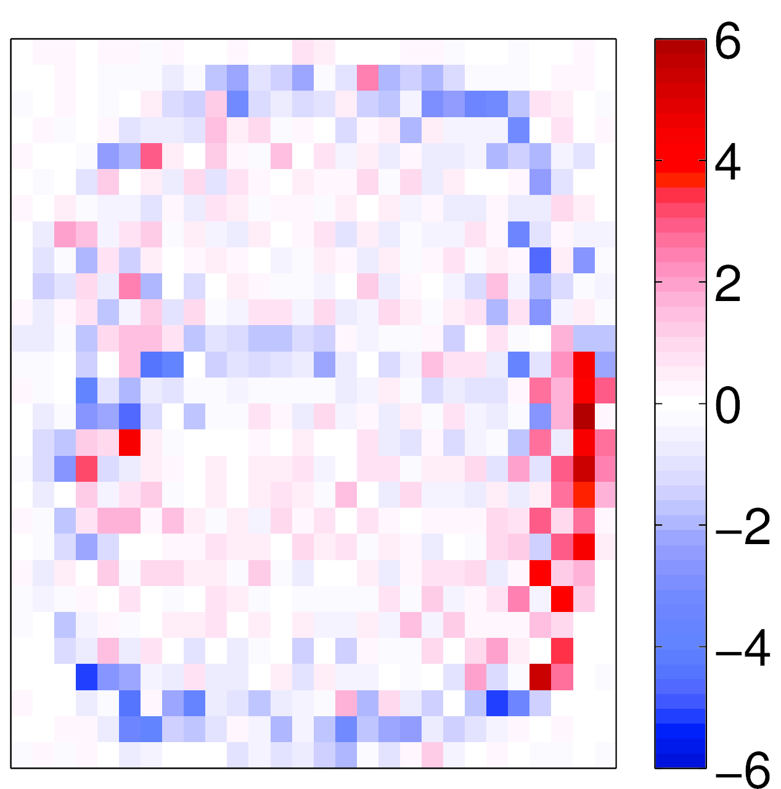
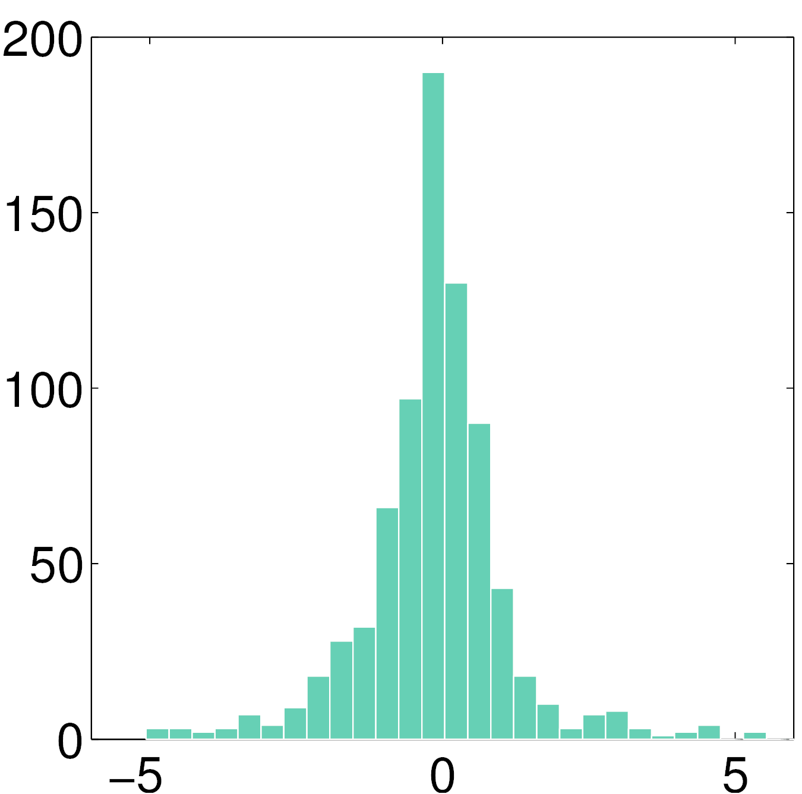
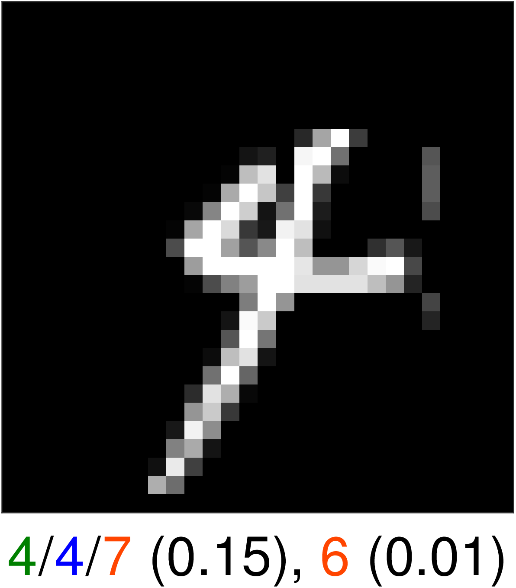
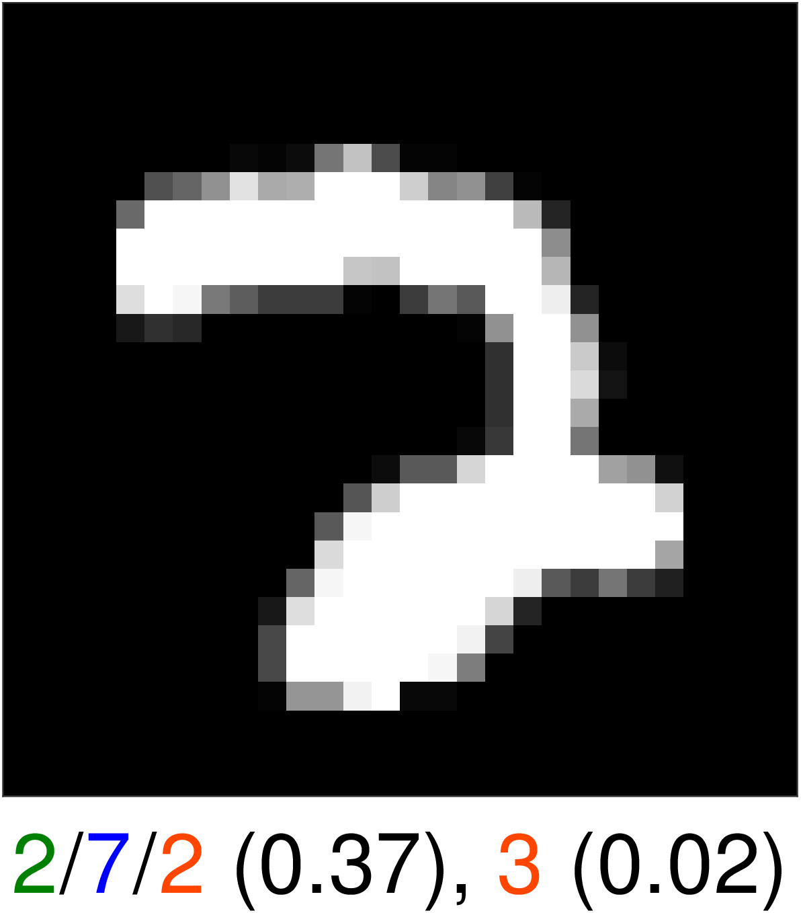
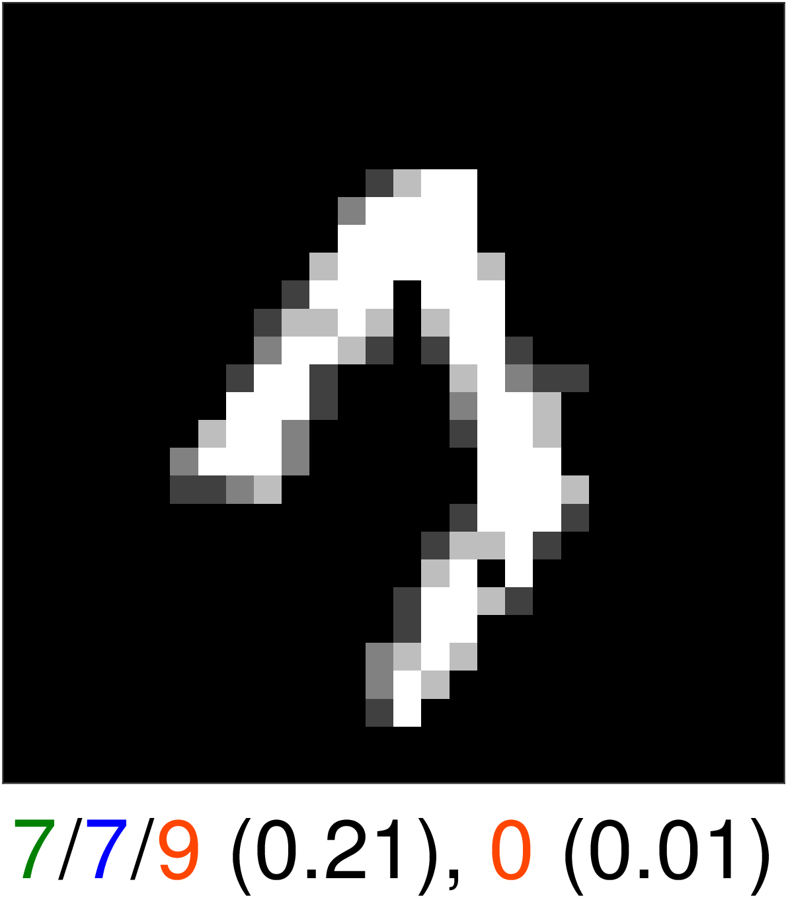
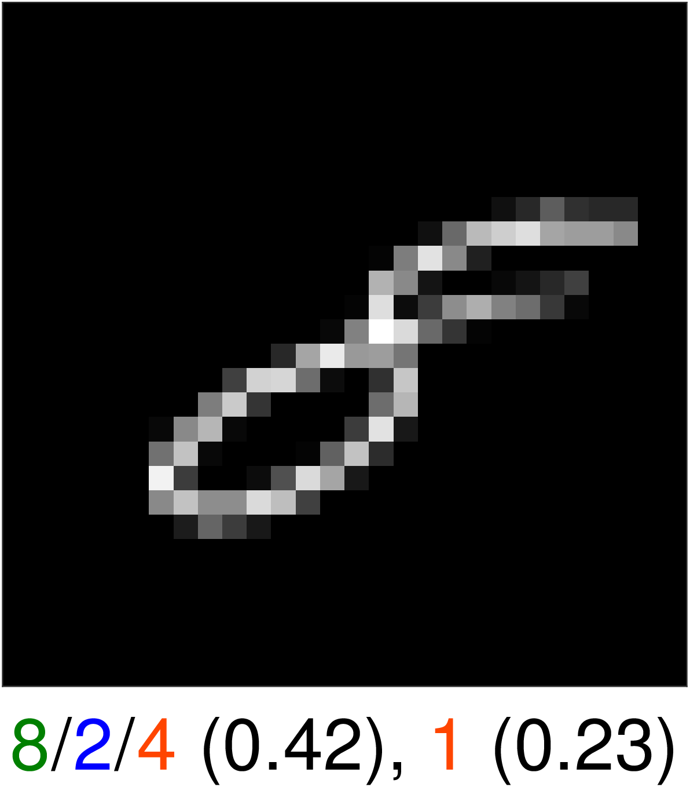

# 2018-MLSP-sparse-bayesian-logistic-regression
Matlab code to reproduce some of the results of the paper.

Maxime Vono, Nicolas Dobigeon, Pierre Chainais, [Sparse Bayesian binary logistic regression using the split-and-augmented Gibbs sampler](https://www.irit.fr/~Maxime.Vono/assets/pdf/MLSP_manuscript.pdf), Proc. of MLSP, 2018.

Copyright
-------

Copyright (c) 2017 Clarice Poon and Gabriel Peyré
